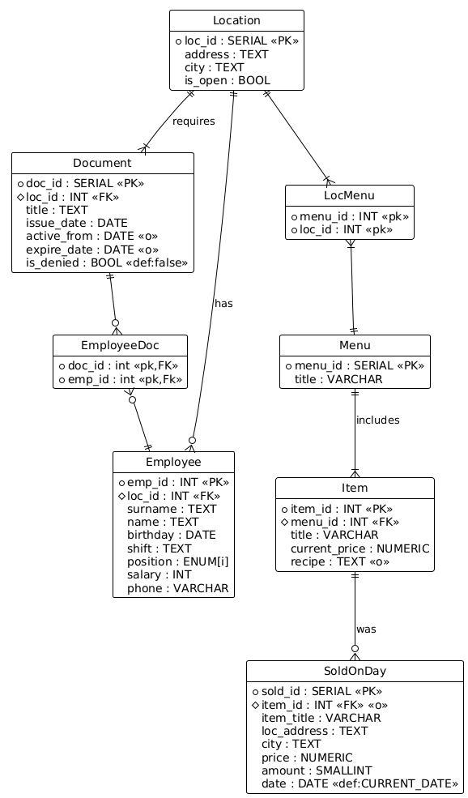
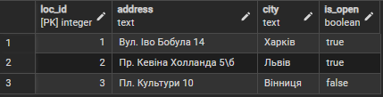
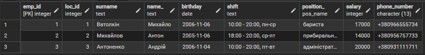
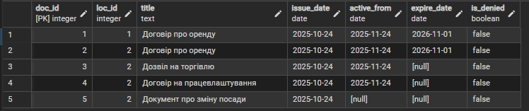
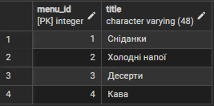
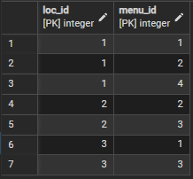
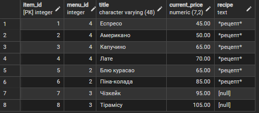
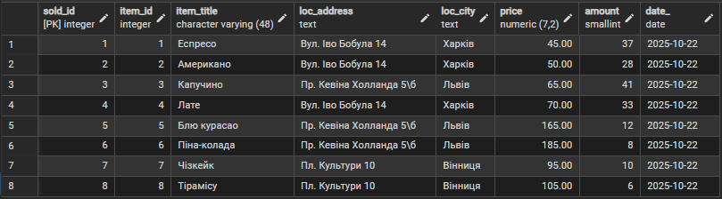

# 📄 Короткий звіт до лабараторної роботи №2

## 🔶 1. Опис схеми

У цьому розділі наведено всі таблиці, їхні стовпці, типи даних, ключі, а також обмеження та зв’язки між таблицями.

---

### 🏢 **Location**
**Призначення:** зберігає інформацію про всі фізичні локації мережі.

| Стовпець | Тип         | Ключ / Обмеження | Опис                                       |
|----------|-------------|-------------|--------------------------------------------|
| `loc_id` | SERIAL      | **PK** | Унікальний ідентифікатор локації           |
| `address` | TEXT | **NOT NULL** | Адреса закладу                             |
| `city`   | TEXT | **NOT NULL** | Місто закладу                              |
| `is_open` | BOOL        | NOT NULL | Прапорець відкриття/закриття               |
| —         |—|**UNIQUE(address,city)**| Запобігає дублюванню одної й тої ж локації |
---

### 📜 **Document**
**Призначення:** зберігає документи, пов’язані з локаціями (напр., договори, акти).

| Стовпець | Тип | Ключ / Обмеження                              | Опис |
|-----------|-----|-----------------------------------------------|------|
| `doc_id` | SERIAL | **PK**                                        | Унікальний ідентифікатор документа |
| `loc_id` | INT | **FK → Location(loc_id)** (ON DELETE CASCADE) | Посилання на локацію |
| `title` | TEXT | NOT NULL                                      | Назва документа |
| `issue_date` | DATE | CHECK (issue_date ≤ CURRENT_DATE)             | Дата видачі |
| `active_from` | DATE | CHECK (active_from ≥ issue_date)              | Початок дії |
| `expire_date` | DATE | CHECK (expire_date > active_from)             | Завершення дії |
| `is_denied` | BOOLEAN | NOT NULL, DEFAULT FALSE                       | Чи відхилено документ |
---

### 🧍‍♂️ Employee
**Призначення:** зберігає інформацію про працівників кожної локації.

| Стовпець | Тип даних      | Ключ / Обмеження                                   | Опис                                                                      |
|-----------|----------------|----------------------------------------------------|---------------------------------------------------------------------------|
| `emp_id` | SERIAL         | **PK**                                             | Унікальний ідентифікатор працівника                                       |
| `loc_id` | INT            | **FK → Location(loc_id)** ON DELETE CASCADE        | Посилання на локацію, де працює працівник                                 |
| `surname` | TEXT           | NOT NULL                                           | Прізвище                                                                  |
| `name_` | TEXT           | NOT NULL                                           | Ім’я                                                                      |
| `birthday` | DATE           | NOT NULL, CHECK (birthday ≤ CURRENT_DATE)          | Дата народження                                                           |
| `shift` | TEXT           | NOT NULL                                           | Робоча зміна працівника                                                   |
| `position_` | ENUM(pos_name) | ('бариста','прибиральник','адміністратор','кухар') | Посада                                                                    |
| `salary` | INT            | NOT NULL, CHECK (salary > 0)                       | Заробітна плата                                                           |
| `phone_number` | CHAR(13)       | NOT NULL, UNIQUE, CHECK ('+380XXXXXXXXX')          | Телефонний номер у форматі +380XXXXXXXXX                                  |
| — |      —          | **UNIQUE(surname, name_, birthday, loc_id)**       | Гарантує унікальність працівника за ПІБ, датою народження і місцем роботи |

### 👥 **EmployeeDoc**
**Призначення:** зв’язок між працівниками та документами (хто підписав \ кого стосується який документ).

| Стовпець | Тип                  | Ключ / Обмеження                              | Опис |
|-----------|----------------------|-----------------------------------------------|------|
| `doc_id` | INT                  | **FK → Document(doc_id)** (ON DELETE CASCADE) | Ідентифікатор документа |
| `emp_id` | INT                  | **FK → Employee(emp_id)** (ON DELETE CASCADE) | Ідентифікатор працівника |
| **PRIMARY KEY** | (`doc_id`, `emp_id`) | —                                             | Забезпечує унікальність комбінації |

---

### 🍽 **Menu**
**Призначення:** зберігає унікальні типи меню (наприклад сніданки, сезонне, напої тощо).

| Стовпець | Тип         | Ключ / Обмеження | Опис |
|-----------|-------------|------------------|------|
| `menu_id` | SERIAL      | **PK** | Ідентифікатор меню |
| `title` | VARCHAR(48) | **UNIQUE, NOT NULL** | Назва меню |

---

### 📍 **LocMenu**
**Призначення:** реалізує зв’язок *багато-до-багатьох* між `Location` і `Menu`.

| Стовпець | Тип | Ключ / Обмеження | Опис |
|-----------|-----|------------------|------|
| `loc_id` | INT | **FK → Location(loc_id)** (ON DELETE CASCADE) | Посилання на локацію |
| `menu_id` | INT | **FK → Menu(menu_id)** (ON DELETE CASCADE) | Посилання на меню |
| **PRIMARY KEY** | (`loc_id`, `menu_id`) | — | Забезпечує унікальність комбінації |

---

### 🍔 **Item**
**Призначення:** елементи меню з актуальними цінами.

| Стовпець | Тип          | Ключ / Обмеження                           | Опис                                                     |
|-----------|--------------|--------------------------------------------|----------------------------------------------------------|
| `item_id` | SERIAL       | **PK**                                     | Ідентифікатор страви                                     |
| `menu_id` | INT          | **FK → Menu(menu_id)** (ON DELETE CASCADE) | Меню, до якого належить страва                           |
| `title` | VARCHAR(48)  | NOT NULL, UNIQUE                           | Назва страви                                             |
| `current_price` | NUMERIC(7,2) | NOT NULL, CHECK (current_price > 0)        | Поточна ціна                                             |
| `recipe` | TEXT         | —                                          | Опис рецепта                                             |
---

### 💵 **SoldOnDay**
**Призначення:** зберігає щоденні продажі конкретних товарів у певних локаціях.

| Стовпець | Тип          | Ключ / Обмеження                                              | Опис |
|--|--------------|---------------------------------------------------------------|------|
| `sold_id` | SERIAL       | **PK**                                                        | Ідентифікатор запису |
| `item_id` | INT          | **FK → Item(item_id)** (ON DELETE SET NULL)                   | Посилання на товар (може бути NULL) |
| `item_title` | VARCHAR(48)  | NOT NULL                                                      | Назва товару (на випадок видалення з меню) |
| `loc_address` | TEXT         | NOT NULL                                                      | Адреса локації |
| `city` | TEXT         | NOT NULL                                                      | Місто |
| `price` | NUMERIC(7,2) | CHECK (price > 0)                                             | Ціна продажу |
| `amount` | SMALLINT     | CHECK (amount ≥ 0)                                            | Кількість проданих одиниць |
| `date_` | DATE         | NOT NULL, DEFAULT CURRENT_DATE, CHECK ( date_ ≤ CURRENT_DATE) | Дата продажу |
| —  | —            | **UNIQUE(`item_title`, `loc_address`, `date_`)**              | Один запис на товар/локацію/дату |

---

## 🗺 2. ER-діаграма відповідної бази даних:

## 📘 3. Припущення та пояснення

> ✏️ 
> - Адреса і назва міста має тип TEXT, бо немає фіксованої довжини ні адреси, ні назви міста. Використання VARCHAR(n) мало б вигляд штучного обмеження. 
> - В документі назва може мати довільну кількість символів, тому вона має тип TEXT.
> - В документі дати повинні мати обмеження CHECK для збереження послідовності дат, також документ не може бути підписаний на майбутнє. Дати вступу документа в силу і дати завершення дії документа може не бути.
> - Ім'я та прізвища робітників можуть мати різну довжину (обрано тип TEXT. Використання VARCHAR(n) мало б вигляд штучного обмеження). Комбінації (surname, name_, birthday, loc_id) гарантують унікальність працівника (умовно).
> - Дата народження працівника не може бути в майбутньому (обмеження  CHECK (birthday ≤ CURRENT_DATE)).
> - Інформація про розклад роботи працівника не має обмеження в довжині (обрано тип TEXT).
> - Працівники мають певний перелік посад, які можуть займати (ENUM(pos_name)).
> - Зарплата не може бути від'ємною (CHECK (salary > 0)).
> - Формат номера телефону чітко встановлено (CHECK ('+380XXXXXXXXX')).
> - Назви позицій в меню і самих меню мають обмеження в 48 символів, бо довга назва не є добре для маркетингу. Це залежить від кав'ярні, тож знаходиться під контролем керівництва (обрано тип VARCHAR(48)).
> - Назва позиції є унікальною для в табличці позицій для забезпечення зв'язку один-до-багатьох.
> - Поточна ціна на позицію більша за 0, не дорожча за 10000 і має точність до сотих (обрано тип NUMERIC(7,2),CHECK (current_price > 0))
> - Рецепт не є обов'язковим (наприлад, булочки замовляються в пекарнях)
> - Ідентифікатори позицій в табличці SoldOnDay встановлюються як NULL при видаленні відповідної позиції (на відміну від всіх інших FOREIG KEY, де весь рядок видаляються). Це забезпечує збереження історії продажів.
> - Позиції і розташування зберігаються в SoldOnDay для оптимізації запитів та збереження історії продажів.
> - Ціна на позицію в SoldOnDay більша за 0, не дорожча за 10000 і має точність до сотих (обрано тип NUMERIC(7,2),CHECK (price > 0)).
> - Кількість проданих позицій не може бути надто великим, тоже має тип SMALLINT, не може бути меншим нуля (CHECK (amount ≥ 0)).
> - Дата в SoldOnDay не може бути з майбутнього, дефолтне значення - сьогодні (DEFAULT CURRENT_DATE, CHECK ( date_ ≤ CURRENT_DATE)).
> - Один запис на товар/локацію/дату в SoldOnDay забезпечується UNIQUE(item_title, loc_address, date_).
---

## 🖼️ 4. Cкріншоти табличок

  
  
  
  
  
  
   
 

